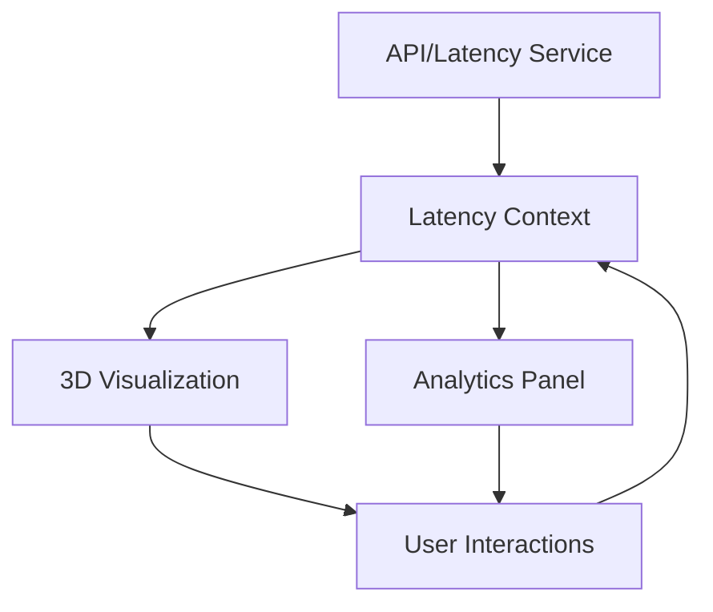

```markdown
# Latency Topology Visualizer

 *<!-- Add your screenshot here -->*

A Next.js application that visualizes cryptocurrency exchange server locations and real-time/historical latency data across AWS, GCP, and Azure regions using 3D world mapping.

[](https://latency-visualizer.vercel.app) *<!-- Add your live link here -->*

## Table of Contents
- [Features](#features)
- [Screenshots](#screenshots)
- [Tech Stack](#tech-stack)
- [Installation](#installation)
- [Configuration](#configuration)
- [Development](#development)
- [Architecture](#architecture)
- [Performance](#performance)
- [Testing](#testing)
- [Future Improvements](#future-improvements)
- [FAQs](#faqs)

## Features

### Core Functionality
✅ **3D World Map Visualization**  
- Interactive globe with smooth camera controls (zoom, rotate, pan)
- Real-time rendering of exchange locations and cloud regions

✅ **Exchange Server Markers**  
- Color-coded markers for AWS, GCP, and Azure hosted servers
- Interactive tooltips with server details
- Selection and highlighting capabilities

✅ **Latency Visualization**  
- Real-time animated connections between nodes
- Color-coded by latency range (green <50ms, yellow <100ms, red >100ms)
- Dynamic line width and dash patterns based on latency

✅ **Historical Data Analysis**  
- Time-series charts for selected pairs
- Configurable time ranges (1h, 24h, 7d)
- Statistical overview (min/max/avg latency)

✅ **Cloud Region Visualization**  
- Provider-specific region boundaries
- Interactive filtering controls
- Coverage area visualization

### Bonus Features Implemented
✨ **Advanced Visual Effects**  
- Marker pulse animations
- Connection flow animations
- Dynamic performance scaling

✨ **Responsive Design**  
- Mobile-friendly controls
- Adaptive rendering quality
- Touch gesture support

✨ **Dark/Light Theme**  
- System preference detection
- Manual toggle control

## Screenshots

  
*Interactive 3D world map with exchange markers and latency connections*

  
*Historical latency trends and statistics for selected pairs*

  
*Responsive design with touch-optimized controls*

## Tech Stack

### Core Technologies
- **Next.js** (v14) - React framework for server-side rendering
- **TypeScript** - Type-safe JavaScript development
- **Three.js** - 3D rendering library
- **React Three Fiber** - Three.js React renderer
- **Drei** - Helpers for React Three Fiber

### Supporting Libraries
- **Tailwind CSS** - Utility-first CSS framework
- **Styled Components** - CSS-in-JS styling
- **Chart.js** - Historical data visualization
- **Zustand** - State management

### Dev Tools
- **ESLint** - Code linting
- **Prettier** - Code formatting
- **Husky** - Git hooks
- **Vercel** - Deployment platform

## Installation

### Prerequisites
- Node.js v18+
- npm v9+ or yarn
- Git

### Setup Instructions

1. Clone the repository:
```bash
git clone https://github.com/your-username/latency-visualizer.git
cd latency-visualizer
```

2. Install dependencies:
```bash
npm install
# or
yarn install
```

3. Set up environment variables:
```bash
cp .env.example .env.local
```
Edit the `.env.local` file with your API keys if needed.

4. Run the development server:
```bash
npm run dev
# or
yarn dev
```

5. Open your browser to:
```
http://localhost:3000
```

## Configuration

### Environment Variables
| Variable | Description | Default |
|----------|-------------|---------|
| `NEXT_PUBLIC_MAPBOX_TOKEN` | Mapbox access token | (optional) |
| `NEXT_PUBLIC_LATENCY_API` | Latency data API endpoint | mock data |

### Performance Tuning
Adjust these values in `src/lib/config.ts`:
```typescript
export const PERFORMANCE_CONFIG = {
  mobile: {
    resolution: 0.8,
    dpr: 1
  },
  desktop: {
    resolution: 1,
    dpr: 1.5
  }
};
```

## Development

### Project Structure
```
src/
├── components/      # React components
│   ├── map/         # UI elements
│   └── ui/      # 3D components
├── contexts/       # React contexts
├── hooks/          # Custom hooks
├── lib/            # Utilities and config
├── pages/          # Next.js pages
├── styles/         # Global styles
└── types/          # TypeScript types
```

### Common Commands
| Command | Description |
|---------|-------------|
| `npm run dev` | Start development server |
| `npm run build` | Create production build |
| `npm run lint` | Run ESLint |
| `npm run format` | Format with Prettier |
| `npm run analyze` | Bundle analysis |

## Architecture

### Data Flow


### Performance Considerations
- **Dynamic Quality Adjustment**: Automatically reduces rendering quality on mobile
- **Data Caching**: Implements SWR for efficient data fetching
- **Selective Rendering**: Only renders visible elements
- **GPU Optimization**: Uses instanced meshes where possible

## Testing

### Test Cases
1. **Map Interaction**
   - Verify zoom/rotate/pan functionality
   - Test marker selection and tooltips

2. **Data Visualization**
   - Confirm real-time updates
   - Verify historical chart rendering

3. **Responsiveness**
   - Test on mobile/tablet/desktop
   - Verify touch controls

To run tests:
```bash
npm test
```

## Future Improvements

### Planned Features
- Latency heatmap overlay
- Network topology diagrams
- Animated trading volume visualization
- PDF report generation

### Optimization Opportunities
- WebGL 2.0 migration
- WASM acceleration for calculations
- CDN for static assets

## FAQs

**Q: How often does the latency data update?**  
A: The demo uses mock data that updates every 5 seconds. With a real API, this would be configurable.

**Q: Can I add custom exchange locations?**  
A: Yes! Edit the data in `src/lib/data/exchange.ts`

**Q: Is mobile performance optimized?**  
A: Yes, the app automatically adjusts rendering quality based on device capabilities.

